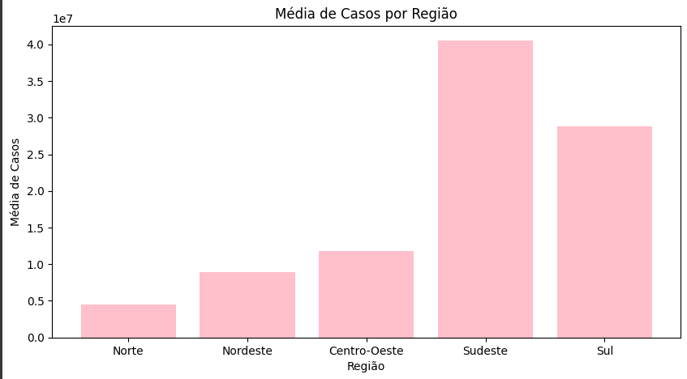

# Análise de Dados da COVID-19 no Brasil (2020-2024)

Este projeto utiliza o **Google Colab** e o **MongoDB Atlas** para realizar uma análise de dados sobre os casos registrados de COVID-19 no Brasil entre os anos de 2020 e 2024. O objetivo é explorar os dados e gerar insights por meio de agrupamentos regionais, mapas interativos e gráficos.

---

## **Objetivos do Projeto**
1. **Elaborar uma base de dados**:
   - Obter dados de COVID-19 no Brasil de fontes confiáveis, como:
     - Sites governamentais.
     - Plataforma Kaggle.
   - Converter os dados em formato JSON.
   - Importar os dados para o **MongoDB Atlas**.

2. **Desenvolver um script Python no Google Colab**:
   - Conectar-se ao MongoDB Atlas.
   - Consultar os dados de COVID-19.

3. **Realizar agrupamentos regionais**:
   - Agrupar os dados por regiões do Brasil:
     - Norte, Nordeste, Centro-Oeste, Sudeste, Sul.
   - Calcular o total de casos registrados em cada região.

4. **Visualizar os dados em mapas interativos**:
   - Utilizar a biblioteca **Folium** para:
     - Marcar pontos centrais de cada região.
     - Mostrar a soma dos casos de COVID-19 por região.

5. **Criar gráficos para análise**:
   - Gerar um gráfico mostrando a **média de casos por região**.
   - Considerar o total de casos registrados em cada estado da região.

6. **Foco em uma região específica**:
   - Região escolhida foi: **Norte**.
   - Exibir em um mapa interativo os casos registrados em **pelo menos 8 grandes cidades** dessa região.

---

## **Tecnologias Utilizadas**
- **Python**:
  - Pandas: Para manipulação de dados.
  - Pymongo: Para conectar ao MongoDB Atlas.
  - Matplotlib e Seaborn: Para visualização de dados.
  - Folium: Para criação de mapas interativos.
- **MongoDB Atlas**: Para armazenamento dos dados em formato JSON.
- **Google Colab**: Ambiente para execução do script e análise dos dados.

---

## **Passo a Passo**
1. **Criação da Base de Dados**:
   - Pesquisa e download de uma base de dados confiável.
   - Converção dos dados para o formato JSON.
   - Importe dos dados para o MongoDB Atlas.

2. **Desenvolvimento no Google Colab**:
   - Configuramos o acesso ao MongoDB Atlas utilizando Pymongo.
   - realizamos consultas para buscar os dados da base.

3. **Análise e Agrupamento**:
   - Realizamos o agrupamento dos casos registrados por região.
   - Calculamos a soma e a média de casos por região.

4. **Visualização Interativa**:
   - Geração de mapas usando a biblioteca Folium:
     - Adicionamos marcadores para os pontos centrais de cada região com os totais de casos.
     - Mostrando as ocorrências nas principais cidades de uma região específica.
     - Criamos gráficos mostrando as médias por região.

---
## **Exemplo de Saída Esperada**
- **Mapa Interativo**:
  - Ponto central de cada região com total de casos registrados.
    
- **Gráfico**:
  - Barra mostrando a média de casos por região.
   
- **Outro Mapa Interativo**:
  - Casos registrados em grande cidade de uma região específica (NORTE).
    
---


## **Como Executar**
1. **Clone este repositório**:
   ```bash
git clone https://github.com/lariiscriis/AnaliseCOVID_googlecolab.git

2. **Abra o notebook no Google Colab.**
- Instale as dependências necessárias:
 ```bash
  !pip install pymongo pandas folium matplotlib seaborn

   ```

3. **Configure a conexão com o MongoDB Atlas:**

- Obtenha a URL de conexão do MongoDB Atlas e substitua no script Python.
- Execute as células do notebook para análise e visualização dos dados.


